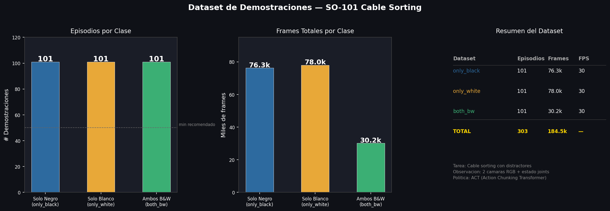
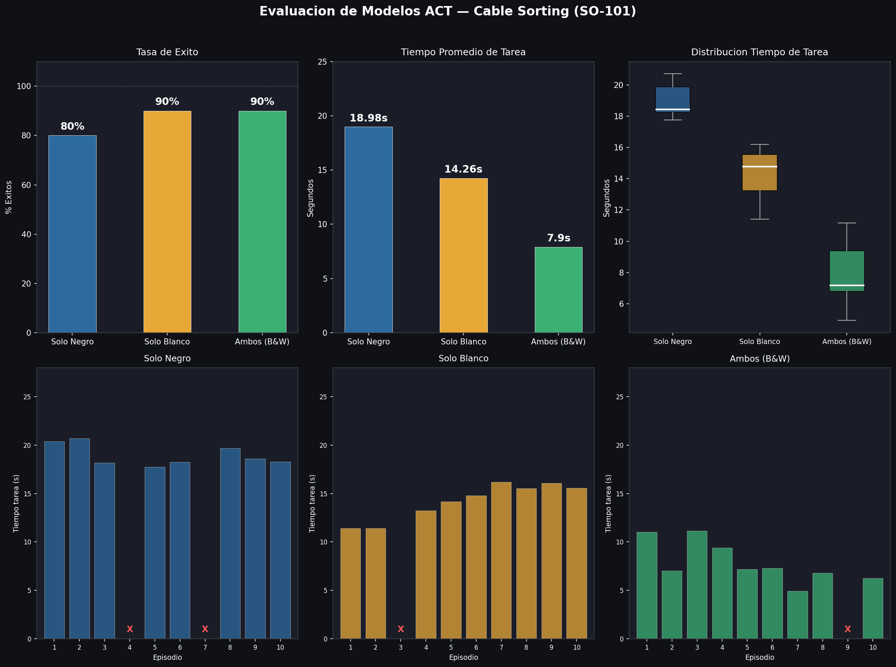
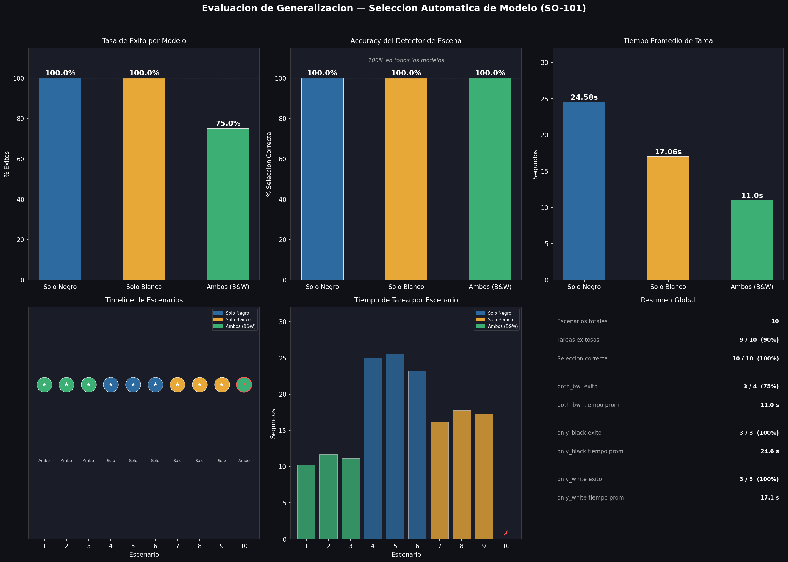

# SO-101 Intelligent Control — Cable Sorting with Imitation Learning

**Intelligent Control Module · Tecnológico de Monterrey · Team 6**

The SO-101 robot learns to pick a colored cable from a terminal and place it in the correct box, in the presence of distractor cables (black/white). A computer vision system based on OpenCV HSV automatically detects the scene and selects the correct ACT policy without human intervention.

| Track | Task | Robot | Method |
|---|---|---|---|
| Imitation Learning — Behaviour Cloning | Option 2 — Laboratory Setup with Clip Wires | SO-101 Follower (6 DOF) | ACT — Action Chunking Transformer |

---

## Results

| Model | Success Rate | Avg Time |
|---|---|---|
| act_only_black | 80% | 18.98 s |
| act_only_white | 90% | 14.26 s |
| act_both_bw | 90% | 7.9 s |
| **Generalization (10 scenarios)** | **90%** | — |
| **Auto selector accuracy** | **100%** | — |

All episodes completed in < 27 seconds ✅

---

## Demo Videos

| Model | Description | Video |
|---|---|---|
| act_only_black | Black distractor present | [YouTube ↗](https://youtu.be/7gXFCimDjyQ) |
| act_only_white | White distractor present | [YouTube ↗](https://youtu.be/EpvfbroREuE) |
| act_both_bw | Both distractors present | [YouTube ↗](https://youtu.be/U0JogTCIOnQ) |

---

## Dataset — HuggingFace

| Dataset | Episodes | Frames | FPS |
|---|---|---|---|
| [AdrielP/cables_il_only_black](https://huggingface.co/datasets/AdrielP/cables_il_only_black) | 101 | 76.3k | 30 |
| [AdrielP/cables_il_only_white](https://huggingface.co/datasets/AdrielP/cables_il_only_white) | 101 | 78.0k | 30 |
| [AdrielP/cables_il_both_bw](https://huggingface.co/datasets/AdrielP/cables_il_both_bw) | 101 | 30.2k | 10 |
| **TOTAL** | **303** | **184.5k** | — |

Each episode includes RGB images from 2 cameras (front + side, 640×480), joint states (6 DOF), and operator actions.

> `both_bw` recorded at 10 FPS — same task duration, lower frame density. The model learns more direct movements.

---

## Models — HuggingFace

| Model | Detected scene | Task executed |
|---|---|---|
| [AdrielP/act_only_black](https://huggingface.co/AdrielP/act_only_black) | Only black cable visible | Picks yellow cable → yellow box |
| [AdrielP/act_only_white](https://huggingface.co/AdrielP/act_only_white) | Only white cable visible | Picks green cable → green box |
| [AdrielP/act_both_bw](https://huggingface.co/AdrielP/act_both_bw) | Black AND white visible | Picks red cable → red box |

---

## System Pipeline

.png)

**Selector logic (OpenCV HSV):**
- Black detected (V < 40, > 4000 px) AND White detected (V > 200, S < 25, > 600 px) → `act_both_bw`
- Black only → `act_only_black`
- White only → `act_only_white`

---

## Architecture — ACT (Action Chunking Transformer)

πθ(aₜ | oₜ) — Behaviour Cloning

**Observation oₜ:**
- Front camera image 640×480 → ResNet18 → features
- Side camera image 640×480 → ResNet18 → features
- Joint states (6 DOF)

**Architecture:**
- Visual backbone: ResNet18 (ImageNet weights)
- Encoder: 4 Transformer layers
- Decoder: 1 Transformer layer
- Attention heads: 8 · Model dim: 512
- Chunk size: 100 actions per inference
- VAE latent dim: 32 · KL weight: 10.0

**Training:**
- Steps: 50,000 per model
- Optimizer: AdamW · lr 1e-5 · weight decay 1e-4
- Training hardware: Google Colab GPU A100
- Framework: LeRobot (HuggingFace)

**Inference:**
- Hardware: CPU — WSL2 Ubuntu 22.04 (~10 Hz)

---

## Result Plots

### Dataset


### Model Evaluation


### Generalization and Auto Selection


---

## Installation

### Requirements
- Ubuntu 22.04 (or WSL2)
- Python 3.10+
- SO-101 robot connected via USB

```bash
git clone https://github.com/carloAdr1/so101-intelligent-control.git
cd so101-intelligent-control
python -m venv venv
source venv/bin/activate
pip install lerobot
```

### Hardware configuration
/dev/ttyACM0  →  SO101 follower (robot)
/dev/ttyACM1  →  SO101 leader (teleop)
/dev/video0   →  front camera
/dev/video2   →  side camera

---

## Usage

### Automatic model selection (full system)
```bash
python scripts/auto_select_model.py
```
Captures a frame from the side camera, detects the scene via HSV, and automatically launches the correct model.

### Run a model manually
```bash
# only_black
lerobot-record \
  --robot.type=so101_follower \
  --robot.port=/dev/ttyACM0 \
  --robot.cameras='{"front":{"type":"opencv","index_or_path":0,"width":640,"height":480,"fps":30},"side":{"type":"opencv","index_or_path":2,"width":640,"height":480,"fps":30}}' \
  --policy.path=AdrielP/act_only_black \
  --dataset.repo_id=AdrielP/eval_only_black \
  --dataset.single_task="state based cable sorting" \
  --dataset.num_episodes=5 \
  --dataset.fps=15 \
  --play_sounds=false
```
Replace `act_only_black` / `eval_only_black` with `act_only_white` or `act_both_bw` as needed.

### Record new demonstrations
```bash
bash scripts/record_il.sh both_bw 100
bash scripts/record_il.sh only_black 100
bash scripts/record_il.sh only_white 100
```

---

## Docker

```bash
# Build
docker build -t so101-intelligent-control .

# Run
docker run --rm -it \
  -v $(pwd)/results:/app/results \
  so101-intelligent-control
```

With hardware access (cameras, robot):
```bash
docker run --rm -it \
  --privileged \
  --device=/dev/ttyACM0 \
  --device=/dev/ttyACM1 \
  --device=/dev/video0 \
  --device=/dev/video2 \
  -v $(pwd)/results:/app/results \
  so101-intelligent-control
```

---

## Evaluation Protocol

**Per-model evaluation (30 episodes total):** 10 episodes × 3 models, fixed cable position, only the distractor present changes. Measures: task success/failure.

**Generalization evaluation (10 scenarios):** Random distractor combinations. The system selects the model automatically. Measures: (1) selector accuracy, (2) task success rate.

See detailed metrics in [`results/metrics/`](results/metrics/).

---

## Limitations

- CPU inference (~10 Hz vs 30 Hz ideal) — robot moves slower than during training
- Fixed cable position during training — low pose variability
- HSV detector sensitive to lighting changes
- Does not generalize to cable positions not seen during training

**Future work:** greater position variability in dataset, Diffusion Policy as ACT alternative, GPU inference, more lighting conditions.

---
## Repository Structure

```
so101-intelligent-control/
├── calibration/          # Archivos de calibración SO101
├── docs/
│   ├── SETUP_WSL_USB.md
│   ├── CAMERA_TESTS.md
│   ├── TELEOPERATION.md
│   ├── CALIBRATION.md
│   └── DATASET_PLAN.md
├── models/               # Referencias a modelos HuggingFace
├── results/
│   ├── metrics/          # Archivos de métricas (CSV/JSON)
│   ├── plots/
│   │   ├── graficas_dataset.png
│   │   ├── graficas_eval.png
│   │   └── graficas_generalizacion.png
│   └── videos/
│       └── demo_links.md
├── scripts/              # Scripts de grabación y utilidades
├── Dockerfile
├── requirements.txt
└── README.md
```

---

## Presentation

Final project presentation (Team 6): [View presentation (PDF)](results/presentation/final_presentation.pdf)

---

**Team 6 · Intelligent Control Module · Tecnológico de Monterrey**
